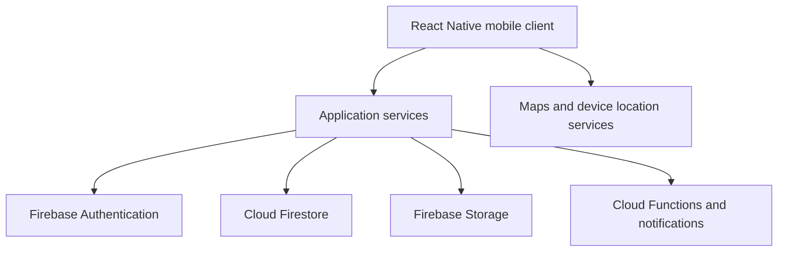
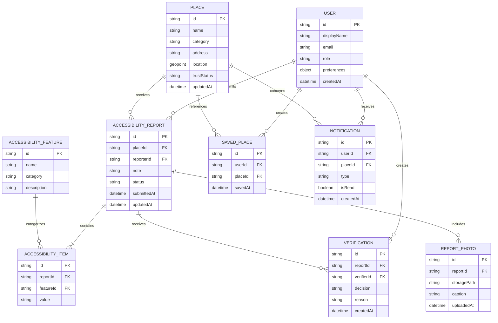

# AccessMapper

**Inclusive Public Space Accessibility Mapper**

AccessMapper is a community-supported mobile application for discovering, reporting and verifying accessibility information about public places. It helps people make informed decisions before visiting a location by showing practical accessibility details supported by community evidence.

> [!IMPORTANT]
> This project is currently in the planning and early implementation stage. Items marked **TO CONFIRM** must be updated using authentic project, Sprint, Git and stakeholder records.

## Table of Contents

- [Project Overview](#project-overview)
- [Problem Statement](#problem-statement)
- [Project Objectives](#project-objectives)
- [Core Features](#core-features)
- [Users and Roles](#users-and-roles)
- [Planned Technology Stack](#planned-technology-stack)
- [System Architecture](#system-architecture)
- [Conceptual Data Model](#conceptual-data-model)
- [Planned Project Structure](#planned-project-structure)
- [Getting Started](#getting-started)
- [Environment Configuration](#environment-configuration)
- [Firebase Setup](#firebase-setup)
- [Development Commands](#development-commands)
- [Accessibility Requirements](#accessibility-requirements)
- [Development Workflow](#development-workflow)
- [Sprint Roadmap](#sprint-roadmap)
- [Testing Strategy](#testing-strategy)
- [Definition of Done](#definition-of-done)
- [Security and Privacy](#security-and-privacy)
- [Project Team](#project-team)
- [Project Evidence](#project-evidence)
- [Generative AI Declaration](#generative-ai-declaration)
- [License](#license)

## Project Overview

Reliable accessibility information about public places is often incomplete, outdated or unavailable. Standard map applications may show a general accessibility symbol without explaining whether a location has an accessible entrance, ramp, lift, toilet, parking space, pathway or other facilities.

AccessMapper addresses this problem through structured accessibility reports, photographs, contextual notes and community verification. The application will show whether information is pending, verified or disputed so users can understand both the accessibility status and the reliability of the available evidence.

### Project summary

| Item | Details |
| --- | --- |
| Project name | AccessMapper |
| Full title | Inclusive Public Space Accessibility Mapper |
| Product type | Cross-platform mobile application |
| Current phase | Planning / Sprint 0 |
| Development method | Scrum |
| Planned iterations | Sprint 0 and four development Sprints |
| Primary platform | Android and iOS through React Native/Expo |
| Backend | Firebase |
| Group | Group 20 - **TO CONFIRM official Course Web group ID** |
| Repository | **TO ADD repository URL** |
| Prototype | **TO ADD Figma/prototype URL** |
| Project board | **TO ADD Jira/Trello URL** |

## Problem Statement

People with mobility, visual, hearing and other accessibility needs may arrive at a public place without knowing whether the location can support them. Existing information can be too general, inconsistent or out of date. This creates uncertainty and can result in wasted journeys, safety concerns and reduced independence.

The project therefore needs a clear, accessible and evidence-supported method of:

1. Discovering public places.
2. Reviewing feature-level accessibility information.
3. Reporting current conditions.
4. Confirming or disputing community reports.
5. Communicating how reliable and recent the information is.

## Project Objectives

- Provide a map and searchable list of public places.
- Display accessibility status using text and icons as well as colour.
- Allow registered users to submit structured accessibility reports.
- Allow users to attach photographs and contextual notes as evidence.
- Support community confirmation and dispute handling.
- Show transparent Pending, Verified and Disputed statuses.
- Allow users to save places and receive relevant notifications.
- Build the application with accessibility included in the acceptance criteria and Definition of Done.
- Maintain traceable project evidence through the task board, Git repository, tests and Sprint documentation.

## Core Features

### 1. Authentication and profile

- User registration and sign-in.
- Basic profile management.
- Optional accessibility and notification preferences.
- Secure sign-out and session handling.

### 2. Discover public places

- Interactive map with nearby public places.
- Search by place name or category.
- Filter by accessibility features and status.
- List view as an alternative to the map.
- Permission-denied and location-unavailable fallback states.

### 3. Place details

- Place name, category, address and map location.
- Feature-level accessibility information.
- Relevant photographs and contextual notes.
- Report date and confirmation count.
- Pending, Verified or Disputed trust status.

### 4. Submit accessibility reports

- Select an existing place or propose a new place.
- Mark each feature as **Present**, **Missing** or **Unknown**.
- Add photographs and explanatory notes.
- Validate required information before submission.
- Edit a previously submitted report when permitted.

### 5. Community verification

- View reports awaiting confirmation.
- Confirm or dispute a report.
- Add a reason and optional supporting evidence.
- Update the public trust status using transparent project rules.
- Escalate unresolved disputes for moderation when required.

### 6. Saved places and notifications

- Save or remove a public place.
- View saved places from the user profile.
- Receive a notification when a saved place receives an important report or status change.

### Future enhancements

- Accessible route planning.
- AI-assisted report guidance.
- Advanced moderation and duplicate-place detection.
- Open accessibility-data export or approved public API.

These enhancements are outside the initial four-Sprint delivery unless the Product Owner formally reprioritizes them.

## Users and Roles

| User role | Main capabilities |
| --- | --- |
| Visitor | Browse the map, search places and view public accessibility information. |
| Registered user | Submit reports, add evidence, save places and manage preferences. |
| Community verifier | Confirm or dispute submitted accessibility information. |
| Moderator | Review serious disputes, inappropriate content and duplicate information. |
| Product stakeholder | Participate in Sprint Reviews and accept or return completed work. |

## Planned Technology Stack

| Area | Planned technology |
| --- | --- |
| Mobile application | React Native with Expo |
| Programming language | TypeScript |
| Navigation | React Navigation / Expo Router - **TO CONFIRM** |
| Maps and location | React Native Maps and device location services |
| Authentication | Firebase Authentication |
| Database | Cloud Firestore |
| Image storage | Firebase Storage |
| Server-side logic | Firebase Cloud Functions where required |
| Notifications | Firebase Cloud Messaging / Expo Notifications - **TO CONFIRM** |
| State management | React Context or Zustand/Redux Toolkit - **TO CONFIRM** |
| Unit/component testing | Jest and React Native Testing Library |
| Code quality | ESLint, Prettier and TypeScript checks |
| Version control | Git and GitHub/GitLab/Bitbucket - **TO CONFIRM host** |
| Project management | Jira or Trello - **TO CONFIRM** |
| UX design | Figma |

## System Architecture



### Main architectural responsibilities

- **Mobile client:** Screens, navigation, accessible controls, form validation and local UI state.
- **Application services:** Shared interfaces for authentication, places, reports, verification, media and notifications.
- **Firebase Authentication:** User identity and authenticated sessions.
- **Cloud Firestore:** Users, places, reports, verification records, saved places and notifications.
- **Firebase Storage:** Report photographs and other approved media.
- **Cloud Functions:** Trusted calculations, notification triggers and moderation-related operations where required.
- **Maps/location services:** Map rendering, location permission and nearby-place discovery.

## Conceptual Data Model

The following ER diagram is a conceptual model. Firestore implementation may use controlled denormalization for performance, but the relationships and source of truth must remain documented.



### Example accessibility features

- Step-free entrance
- Ramp availability and condition
- Lift/elevator availability
- Accessible toilet
- Accessible parking
- Pathway width and surface condition
- Handrails
- Accessible seating
- Clear signage
- Service-counter accessibility

The final checklist must be reviewed with the identified customer/stakeholder before implementation is considered complete.

## Planned Project Structure

```text
AccessMapper/
|- assets/
|- src/
|  |- components/
|  |- features/
|  |  |- auth/
|  |  |- discovery/
|  |  |- places/
|  |  |- reports/
|  |  |- verification/
|  |  |- savedPlaces/
|  |  `- notifications/
|  |- navigation/
|  |- screens/
|  |- services/
|  |  |- firebase/
|  |  `- maps/
|  |- hooks/
|  |- store/
|  |- types/
|  |- utils/
|  `- constants/
|- tests/
|- .env.example
|- app.json
|- package.json
|- tsconfig.json
`- README.md
```

The structure may change after the Sprint 0 architecture review. Any major change should be recorded as a project decision.

## Getting Started

### Prerequisites

Install the following before running the application:

- Node.js current LTS version
- npm or another agreed package manager
- Git
- Expo Go on a physical device, or Android Studio/iOS Simulator
- Access to the team Firebase project
- A configured maps API key if required by the selected map provider

### Installation

```bash
git clone TO_ADD_REPOSITORY_URL
cd AccessMapper
npm install
```

Create the local environment file:

```bash
cp .env.example .env
```

Add the approved development configuration values, then start the application:

```bash
npx expo start
```

Use the Expo development interface to open the app on Android, iOS or Expo Go.

## Environment Configuration

The planned `.env.example` file should contain variable names only:

```dotenv
EXPO_PUBLIC_FIREBASE_API_KEY=
EXPO_PUBLIC_FIREBASE_AUTH_DOMAIN=
EXPO_PUBLIC_FIREBASE_PROJECT_ID=
EXPO_PUBLIC_FIREBASE_STORAGE_BUCKET=
EXPO_PUBLIC_FIREBASE_MESSAGING_SENDER_ID=
EXPO_PUBLIC_FIREBASE_APP_ID=
EXPO_PUBLIC_GOOGLE_MAPS_API_KEY=
```

> [!WARNING]
> Never commit service-account files, private keys, unrestricted production API keys or real user data. Firebase client configuration must be protected by correct Authentication, Firestore, Storage and API-key restrictions.

## Firebase Setup

1. Create or select the team Firebase project.
2. Register the mobile application with Firebase.
3. Enable the agreed sign-in method, initially Email/Password if approved.
4. Create the Cloud Firestore database.
5. Enable Firebase Storage for report photographs.
6. Configure Firestore and Storage security rules before using real data.
7. Configure notification services if notifications are included in the current Sprint.
8. Add the Firebase client configuration to the local `.env` file.
9. Use development/test accounts and non-sensitive sample data during implementation.

Recommended initial Firestore collections:

```text
users
places
accessibilityFeatures
reports
verifications
savedPlaces
notifications
```

The final structure, indexes and rules must be reviewed and committed to the repository.

## Development Commands

Keep this table synchronized with the scripts in `package.json`.

| Command | Purpose |
| --- | --- |
| `npm install` | Install project dependencies. |
| `npx expo start` | Start the Expo development server. |
| `npm run android` | Run the Android development build. |
| `npm run ios` | Run the iOS development build where supported. |
| `npm run web` | Run the web preview if enabled. |
| `npm test` | Run automated tests after the test setup is added. |
| `npm run lint` | Run ESLint checks after linting is configured. |
| `npm run typecheck` | Run the TypeScript compiler without producing a build. |

Remove or update any command that is not implemented in `package.json`.

## Accessibility Requirements

Accessibility is a product requirement, not a final-stage visual check.

Every core flow should include:

- Screen-reader labels, roles, states and hints where necessary.
- A logical reading and focus order.
- Meaningful headings and plain-language instructions.
- Text scaling without clipping or overlapping content.
- Sufficient colour contrast.
- Text and icon cues so information does not rely on colour alone.
- Platform-appropriate touch-target sizes.
- Clear validation messages connected to the relevant field.
- Keyboard support where the platform and test environment allow it.
- Loading, empty, permission-denied, offline and error states.
- Captions or descriptions for relevant report photographs.
- Reduced or non-essential animation where practical.

Core flows must be manually reviewed with Android TalkBack and/or iOS VoiceOver before a story is marked Done.

## Development Workflow

### Branch strategy

| Branch | Purpose |
| --- | --- |
| `main` | Stable reviewed version suitable for demonstration. |
| `develop` | Integrated development work for the active Sprint. |
| `feature/AM-###-short-name` | New feature linked to a backlog item. |
| `fix/AM-###-short-name` | Bug fix linked to a backlog item. |
| `docs/AM-###-short-name` | Documentation-only change. |

Example:

```text
feature/AM-006-nearby-map
```

### Commit messages

Use clear messages that explain the change and reference the backlog item:

```text
feat(AM-006): add nearby place markers
fix(AM-011): validate unknown accessibility state
test(AM-005): add authentication error-state tests
docs(AM-002): update project charter link
```

Do not create empty or artificial commits to increase contribution counts.

### Pull-request process

1. Link the relevant story/task.
2. Explain what changed and why.
3. Add screenshots for user-interface changes.
4. Record testing completed.
5. Record accessibility checks completed.
6. Request review from another available team member.
7. Resolve comments before merging.
8. Update the project board after the merge.

## Sprint Roadmap

| Sprint | Planned focus | Main increment |
| --- | --- | --- |
| Sprint 0 | Initiation and foundation | Charter, stakeholder, backlog, architecture, design baseline, repository and project board |
| Sprint 1 | Discover | Authentication, map/list discovery, non-colour status cues, search and place details |
| Sprint 2 | Contribute | Place selection, accessibility checklist, photographs, notes, submission and permitted editing |
| Sprint 3 | Verify | Verification queue, confirm/dispute actions, transparent trust status, saved places and preferences |
| Sprint 4 | Release | Integration, notifications, moderation essentials, accessibility validation, regression testing and demo preparation |

Actual Sprint dates, capacity, selected stories, owners and results must come from the approved project board.

## Testing Strategy

| Test level | Examples |
| --- | --- |
| Unit testing | Validation, status calculation, filters and utility functions |
| Component testing | Forms, buttons, report checklist, empty/error states and accessibility props |
| Integration testing | Authentication, Firestore reads/writes, photo upload and verification flow |
| Security testing | Firestore/Storage rules, unauthorized updates and ownership restrictions |
| Accessibility testing | TalkBack/VoiceOver, focus order, labels, text scaling, contrast and touch targets |
| Manual device testing | Android/iOS permissions, camera/gallery, location, offline and slow-network behaviour |
| Regression testing | Recheck completed core flows before Sprint Review and final release |

Test evidence should be linked to the relevant backlog item and retained for Sprint Review.

## Definition of Done

A backlog item is Done only when:

- Acceptance criteria are satisfied.
- The implementation supports the current Sprint Goal.
- Code is reviewed and merged through the agreed workflow.
- Relevant tests pass.
- Lint and TypeScript checks pass.
- Accessibility checks are completed.
- Loading, error and empty states are handled where relevant.
- Security rules and permissions are reviewed for data operations.
- The project board and documentation are updated.
- Evidence is attached or linked.
- The increment can be demonstrated.

Incomplete work returns transparently to the Product Backlog.

## Security and Privacy

- Request location, camera and media permissions only when required.
- Explain why a permission is needed before or when requesting it.
- Do not continuously track user location unless explicitly approved and documented.
- Store only the minimum personal information required.
- Protect user-owned reports and profile records through Firebase security rules.
- Validate file type and size for uploaded photographs.
- Avoid exposing sensitive personal information in photographs and notes.
- Record report and verification timestamps for transparency.
- Provide a process for reporting inappropriate or misleading content.
- Never store privileged server credentials in the mobile application.
- Use test data rather than real personal data during development.

Community reports are informational and must not be presented as a legal accessibility certification.

## Project Team

The official group composition must remain consistent with the Course Web record.

| Registration number | Member | Planned component/leadership area | Scrum role |
| --- | --- | --- | --- |
| IT23565012 | DISSANAYAKA L I S | Map, markers and place discovery | **TO CONFIRM per Sprint** |
| IT23608740 | NADEESHAN R M K | Profiles, saved places, notifications and integration | **TO CONFIRM per Sprint** |
| IT23633322 | SANDARUWAN H M K | Verification queue, confirm/dispute and trust integration | **TO CONFIRM per Sprint** |
| IT23845978 | HASARANGA M N | Report submission, issue reporting and accessibility UX quality | **TO CONFIRM per Sprint** |

Actual availability and contribution must be documented using authentic task-board history, pull requests, commits, tests and Scrum-event records.

## Project Evidence

The repository should preserve clear evidence from Sprint 0 onward:

- Meaningful Git commits linked to backlog items.
- Pull requests and review history.
- Sprint board updates and exports.
- Sprint Planning, Daily Scrum, Review and Retrospective records.
- Product Backlog and Sprint Backlogs.
- Sprint 1 and Sprint 2 burndown data.
- Design artefacts and decision records.
- Test and accessibility-check results.
- Screenshots or build details for working increments.
- Stakeholder feedback and resulting backlog changes.

| Evidence | Link |
| --- | --- |
| Product/project board | **TO ADD** |
| Git repository | **TO ADD** |
| Figma prototype | **TO ADD** |
| Sprint documentation | **TO ADD** |
| Test evidence | **TO ADD** |
| Working demo/build | **TO ADD** |

## Generative AI Declaration

Generative AI tools, including ChatGPT, may be used as learning and drafting assistants for planning, documentation, explanation, debugging or sample-code guidance. All AI-assisted content and code must be reviewed, understood, adapted and tested by the team before submission or merging.

Significant use of AI must be declared in the assignment appendix in accordance with the CLEAR framework:

- **Collaborate:** Use AI as an assistant, not as a replacement for team work.
- **Learn:** Understand the generated output.
- **Evaluate:** Verify and test the output.
- **Acknowledge:** Declare significant use.
- **Reflect:** Be prepared to explain how AI supported learning.

AI-generated placeholder data is not evidence of completed project work.

## License

This repository is currently intended for academic project work. A public reuse licence has not yet been selected.

**Licence status: TO CONFIRM before public release.**

